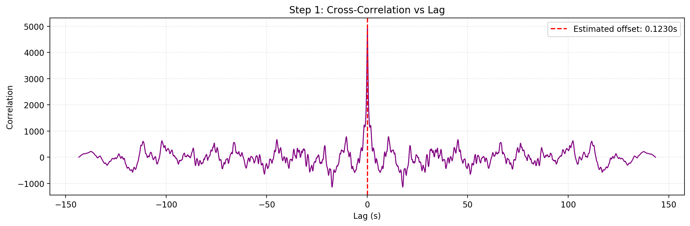
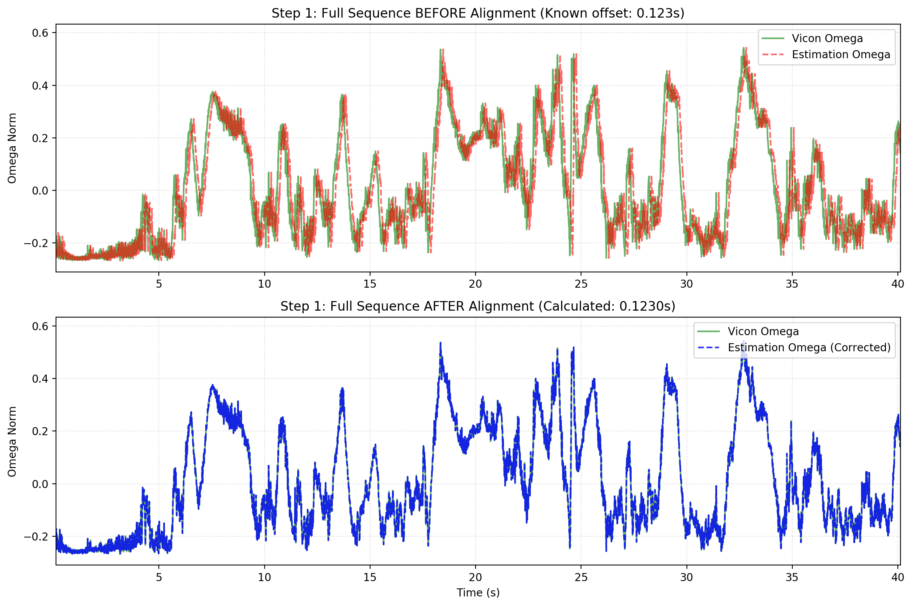
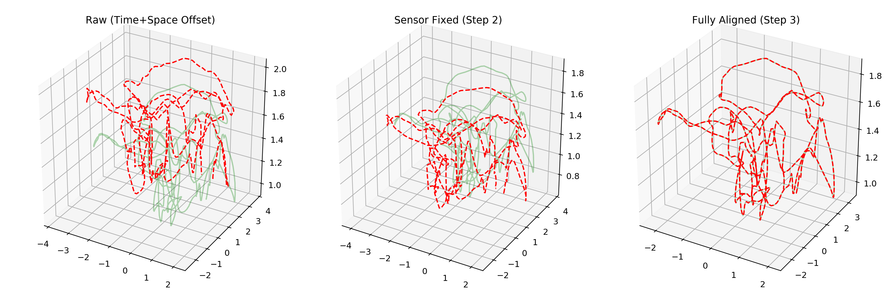
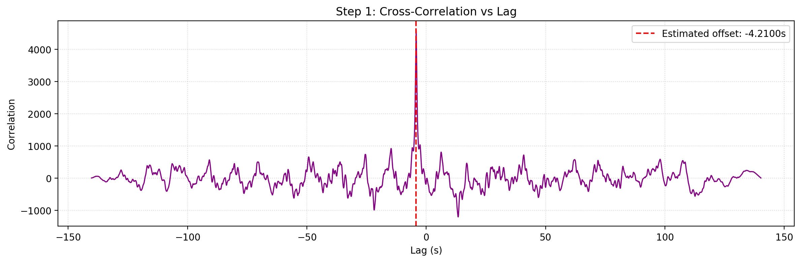
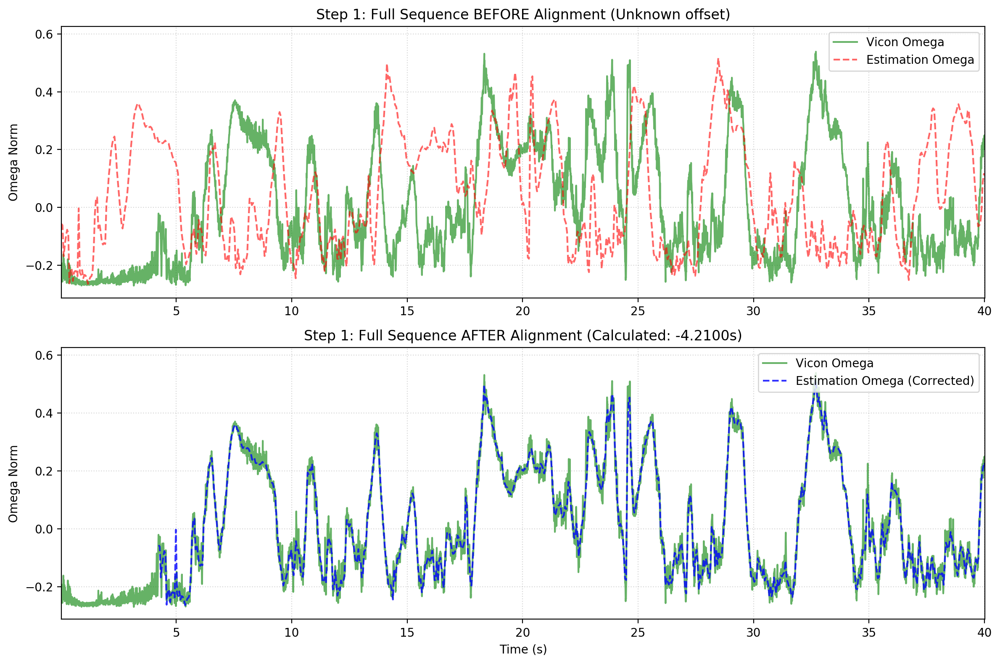
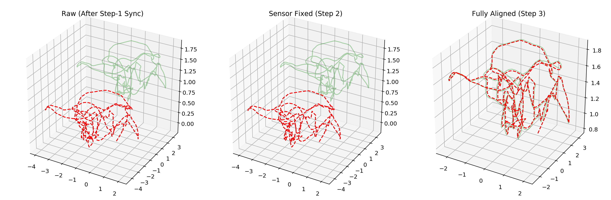

# vicon_ws

TODO:
2026/4/10

- evo支持更多的格式, vicon后面可以加上
- 可考虑模仿evo, 补齐成一个完整的工具链cli
- 可视化没做好, 可以参考evo弄个rerun
- rerun的配置还没弄好(目前只能回放带有frame的轨迹(gt/3-step后的estimation/raw estimation(可选)), 渐变没弄好)
- 重写了项目结构, 使其易于扩展和复用, 也保留了上个版本的pipeline.py
- 把evo的metrics加了进来, 看看有什么可以新增的metrics
- 用现在的vicon_ws和evo分别跑了alignanything, 结果在vicon_ws/outputs/alignanything_eval/summary_final.md
- 现在evo的结果用了vicon_ws的offset, 后面可以改成人工sweep最优
- vicon_ws的方法层面可能可以改进, 后面再看看
- 上面这些弄得差不多了可以做个wiki网站
---

Workspace for trajectory-level replacement and 3-step alignment:

1. Step1: time alignment
2. Step2: sensor extrinsic solve (`R_ext`, `t_ext`)
3. Step3: world-frame rigid alignment (`R_w`, `t_w`)

The pipeline is implemented in `pipeline.py` and supports:

## Project Layout

- `pipeline.py`: main 3-step pipeline
- `gt.csv`: GT trajectory (EuRoC-style CSV)
- `outputs/traj_estimate_v1_01.txt`: estimation trajectory exported by [`sqrtVINS`](https://github.com/rpng/sqrtVINS.git)
- `sqrtVINS-main/`: local [`sqrtVINS`](https://github.com/rpng/sqrtVINS.git) source snapshot
- `track.md`: Chinese process notes

## [sqrtVINS](https://github.com/rpng/sqrtVINS.git) Configuration

Configured in `sqrtVINS-main/ov_srvins/launch/serial.launch`:

- bag: `/home/yifu/vicon_room1/V1_01_easy/V1_01_easy.bag`
- path_est: `/home/yifu/vicon_ws/outputs/traj_estimate_v1_01.txt`

Before running `pipeline.py` in real mode, you must build [`sqrtVINS`](https://github.com/rpng/sqrtVINS.git) and run it once to generate estimation output.

Run in Native System with EurocMav Dataset (Ubuntu 20.04 + ROS1 as Example):

```bash
# Step 1: Create the workspace
mkdir -p ~/sqrt_vins_ws/src
cd ~/sqrt_vins_ws/src
git clone https://github.com/rpng/sqrtVINS.git

# Step 2: Build
cd ~/sqrt_vins_ws
catkin build

# Step 3: Download EurocMav rosbag:
# https://projects.asl.ethz.ch/datasets/doku.php?id=kmavvisualinertialdatasets
# Put bag files under: $HOME/datasets/euroc_mav
# Or change the bag path in: ov_srvins/launch/serial.launch

# Step 4: Run the launch file
source ~/sqrt_vins_ws/devel/setup.bash
roslaunch ov_srvins serial.launch
```

After it finishes, the estimation trajectory is saved to:

`/home/yifu/vicon_ws/outputs/traj_estimate_v1_01.txt`

## Run 3-Step Alignment

> Important:
> If you see `Calculated Time Offset: 0.1230 s`, you are in synthetic mode.
> `0.123` is the injected ground-truth offset for closed-loop validation, not the real estimation-vs-GT result.
> For real data evaluation, do NOT pass `--synthetic`.

### Optional: Rerun Visualization

`vicon_ws` now supports optional Rerun trajectory logging in modular mode.

Install dependency:

```bash
pip install rerun-sdk
```

Example (real mode + rerun):

```bash
PYTHONPATH=/home/yifu/vicon_ws/src python3 -m vicon_ws.cli \
  --engine modular \
  --gt-csv /home/yifu/vicon_ws/gt.csv \
  --est-path /home/yifu/vicon_ws/outputs/traj_estimate_v1_01.txt \
  --est-format tum \
  --rerun
```

Optional flags:

- `--rerun-no-spawn`: do not auto-open viewer
- `--rerun-stride N`: downsample static trajectory lines sent to rerun
- `--rerun-motion-stride N`: downsample timeline replay points (smaller = smoother motion)

Playback note:

- Static context includes 4 trajectories: `raw`, `step2`, `step3`, `gt`
- Timeline replay shows moving points over time, with `raw` and `gt` emphasized
- `step2` and `step3` are intentionally lighter as visual references
- `--rerun` follows evo behavior: viewer logging only, no automatic `.rrd` output

### A) Synthetic Injection vs GT

Run command:

```bash
MPLBACKEND=Agg python3 pipeline.py --synthetic
```

Use this mode when you want closed-loop validation with known injected truth.

Corresponding kept output folder in this repo:

- `outputs/run_20260402_172740`

Key files:

- `outputs/run_20260402_172740/step1_cross_correlation.png`
- `outputs/run_20260402_172740/step1_time_alignment.png`
- `outputs/run_20260402_172740/step23_trajectory_alignment_3d.png`
- `outputs/run_20260402_172740/metrics.json`
- `outputs/run_20260402_172740/metrics_summary.csv`

Visualizations:





Terminal output (excerpt):

```text
--- STEP 1: TIME ALIGNMENT ---
Calculated Time Offset: 0.1230 s

--- TIME ALIGNMENT METRICS ---
offset_est_s: 0.123000 s
offset_err_ms: 0.000000 ms
xcorr_peak_normalized: 0.998538
xcorr_psr: 13.442643
omega_rmse_before: 0.095181 rad/s
omega_rmse_after: 0.001707 rad/s
omega_rmse_improve_pct: 98.206136 %

--- STEP 2: SOLVING EXTRINSICS ---
Calculated Extrinsic Rotation Matrix:
[[ 0.6645 -0.6645 -0.342 ]
 [ 0.4915  0.7333 -0.4698]
 [ 0.563   0.1441  0.8138]]
Calculated Translation: [ 0.5 -0.2  0.1] m

--- STEP 3: WORLD ALIGNMENT ---
Calculated World Rotation Matrix:
[[ 0.9063 -0.4226  0.    ]
 [ 0.4226  0.9063  0.    ]
 [ 0.      0.      1.    ]]
Calculated World Translation: [ 1.5 -0.5  0.3] m

--- STEP 2 RESIDUAL METRICS ---
rot_res_mean_deg: 0.000000 deg
rot_res_median_deg: 0.000000 deg
rot_res_p95_deg: 0.000000 deg
trans_eq_rmse_m: 0.000000 m
trans_eq_p95_m: 0.000000 m
translation_system_cond: 1.879618
translation_constraints: 24182.000000

--- TRAJECTORY METRICS ---
ate_rmse_raw_m: 1.514741 m
ate_rmse_step2_m: 1.626141 m
ate_rmse_step3_m: 0.000000 m
ate_p95_raw_m: 2.361690 m
ate_p95_step2_m: 2.463500 m
ate_p95_step3_m: 0.000000 m
ate_rmse_improve_raw_to_step3_pct: 100.000000 %
ate_rmse_improve_step2_to_step3_pct: 100.000000 %
```

### B) sqrtVINS Estimation vs GT

Run command:

```bash
MPLBACKEND=Agg python3 pipeline.py \
  --gt-csv /home/yifu/vicon_ws/gt.csv \
  --est-path /home/yifu/vicon_ws/outputs/traj_estimate_v1_01.txt \
  --est-format tum \
  --quat-interp linear
```

Use this mode for real estimation trajectory alignment against GT. (`linear` is the default interpolation mode.)
Prerequisite: `roslaunch ov_srvins serial.launch` has already generated `outputs/traj_estimate_v1_01.txt`.

Quick self-check after running:

- Open `outputs/run_xxx/metrics.json`
- Ensure `metadata.mode` is `real`
- If `metadata.mode` is `synthetic`, rerun without `--synthetic`

Corresponding kept output folder in this repo:

- `outputs/run_20260404_195554`

Key files:

- `outputs/run_20260404_195554/step1_cross_correlation.png`
- `outputs/run_20260404_195554/step1_time_alignment.png`
- `outputs/run_20260404_195554/step23_trajectory_alignment_3d.png`
- `outputs/run_20260404_195554/metrics.json`
- `outputs/run_20260404_195554/metrics_summary.csv`
- `outputs/run_20260404_195554/metrics_zh.md`

Visualizations:





Terminal output (excerpt):

```text
--- STEP 1: TIME ALIGNMENT ---
Calculated Time Offset: -4.2100 s

--- TIME ALIGNMENT METRICS ---
offset_est_s: -4.210000 s
offset_err_ms: nan ms
xcorr_peak_normalized: 0.946500
xcorr_psr: 13.044565
omega_rmse_before: 0.266979 rad/s
omega_rmse_after: 0.071856 rad/s
omega_rmse_improve_pct: 73.085639 %

--- STEP 2: SOLVING EXTRINSICS ---
Calculated Extrinsic Rotation Matrix:
[[ 9.995e-01  3.040e-02  6.000e-04]
 [-3.040e-02  9.989e-01 -3.500e-02]
 [-1.700e-03  3.490e-02  9.994e-01]]
Calculated Translation: [ 0.0124 -0.0584  0.0035] m

--- STEP 3: WORLD ALIGNMENT ---
Calculated World Rotation Matrix:
[[ 0.9757 -0.219   0.0028]
 [ 0.219   0.9757 -0.0037]
 [-0.0019  0.0042  1.    ]]
Calculated World Translation: [0.9195 2.2292 0.9774] m

--- STEP 2 RESIDUAL METRICS ---
rot_res_mean_deg: 0.092905 deg
rot_res_median_deg: 0.011208 deg
rot_res_p95_deg: 0.039137 deg
trans_eq_rmse_m: 0.000161 m
trans_eq_p95_m: 0.000250 m
translation_system_cond: 1.879618
translation_constraints: 24182.000000

--- TRAJECTORY METRICS ---
ate_rmse_raw_m: 2.641057 m
ate_rmse_step2_m: 2.672112 m
ate_rmse_step3_m: 0.051962 m
ate_p95_raw_m: 2.889131 m
ate_p95_step2_m: 2.930739 m
ate_p95_step3_m: 0.082088 m
ate_rmse_improve_raw_to_step3_pct: 98.032546 %
ate_rmse_improve_step2_to_step3_pct: 98.055411 %
```

### C) sqrtVINS Estimation vs GT (SLERP Quaternion Interpolation)

Run command:

```bash
MPLBACKEND=Agg python3 pipeline.py \
  --gt-csv /home/yifu/vicon_ws/gt.csv \
  --est-path /home/yifu/vicon_ws/outputs/traj_estimate_v1_01.txt \
  --est-format tum \
  --quat-interp slerp
```

This result is generated with explicit SLERP quaternion interpolation in `pipeline.py`.

Output folder:

- `outputs/run_20260406_202611`

Visualizations:




Terminal output (excerpt):

```text
--- STEP 1: TIME ALIGNMENT ---
Calculated Time Offset: -4.2100 s

--- TIME ALIGNMENT METRICS ---
offset_est_s: -4.210000 s
offset_err_ms: nan ms
xcorr_peak_normalized: 0.946500
xcorr_psr: 13.044565
omega_rmse_before: 0.266979 rad/s
omega_rmse_after: 0.071856 rad/s
omega_rmse_improve_pct: 73.085639 %

--- STEP 2: SOLVING EXTRINSICS ---
Calculated Extrinsic Rotation Matrix:
[[ 9.998e-01  1.770e-02  3.000e-04]
 [-1.770e-02  9.998e-01  5.900e-03]
 [-2.000e-04 -5.900e-03  1.000e+00]]
Calculated Translation: [ 0.0087 -0.0708 -0.0013] m

--- STEP 3: WORLD ALIGNMENT ---
Calculated World Rotation Matrix:
[[ 0.9759 -0.2183  0.0033]
 [ 0.2183  0.9759 -0.0039]
 [-0.0023  0.0045  1.    ]]
Calculated World Translation: [0.9187 2.2368 0.9765] m

--- STEP 2 RESIDUAL METRICS ---
rot_res_mean_deg: 0.012536 deg
rot_res_median_deg: 0.010676 deg
rot_res_p95_deg: 0.028083 deg
trans_eq_rmse_m: 0.000221 m
trans_eq_p95_m: 0.000358 m
translation_system_cond: 1.879618
translation_constraints: 24182.000000

--- TRAJECTORY METRICS ---
ate_rmse_raw_m: 2.641057 m
ate_rmse_step2_m: 2.677696 m
ate_rmse_step3_m: 0.057018 m
ate_p95_raw_m: 2.889131 m
ate_p95_step2_m: 2.937338 m
ate_p95_step3_m: 0.089880 m
ate_rmse_improve_raw_to_step3_pct: 97.841105 %
ate_rmse_improve_step2_to_step3_pct: 97.870645 %
```

## Output Per Run

Each run creates:

`outputs/run_YYYYMMDD_HHMMSS/`

Artifacts:

- `step1_cross_correlation.png`
- `step1_time_alignment.png`
- `step23_trajectory_alignment_3d.png`
- `metrics.json`
- `metrics_summary.csv`
- `metrics_zh.md` (generated by current `pipeline.py`)

## Notes

- TUM input accepts at least 8 columns; if covariance columns exist, columns after `t tx ty tz qx qy qz qw` are ignored.
- `step1_time_alignment.png` uses a 40-second window by default for easier visual inspection.
- Quaternion interpolation mode is configurable via `--quat-interp {linear,slerp}`; default is `linear`.
- Each run outputs `metrics_zh.md` (Chinese metric interpretation with value-specific analysis).
