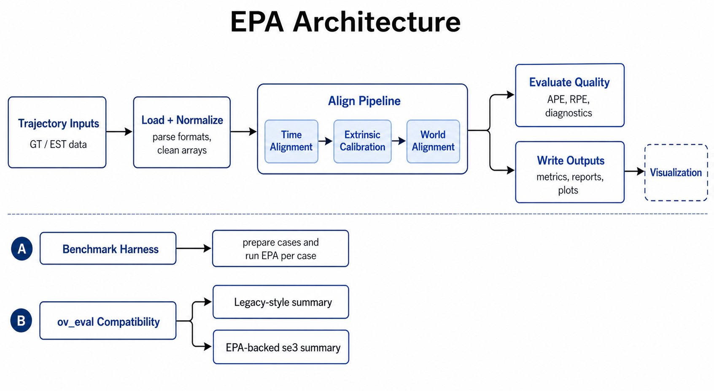
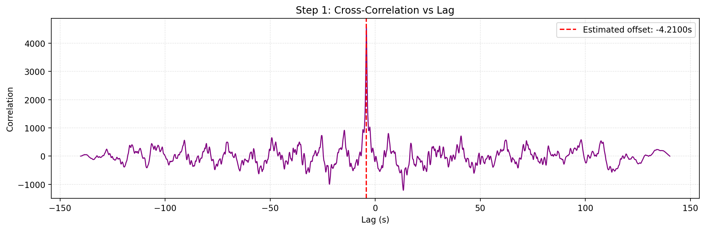

# Architecture

This page explains how `epica` is organized, how the main pipeline runs, and where each responsibility lives in the codebase.

Use this page when you want to understand how the main pipeline fits together, where to look in the code, or which module to extend next.

## High-Level Execution Flow

For the main pipeline, the execution path is:

```text
`epa` / `epica` command
  -> epa.runner
  -> epa.core.pipeline_modular
  -> time alignment
  -> extrinsic calibration
  -> world-frame alignment
  -> metric evaluation
  -> outputs/run_YYYYmmdd_HHMMSS/
```

At a high level, the modular pipeline does this:

1. load reference and estimation trajectories
2. optionally crop them by time window
3. perform step-1 time alignment
4. solve step-2 extrinsic calibration
5. solve step-3 world-frame alignment
6. compute APE and RPE metrics
7. write metrics, reports, plots, and optional result bundles

## System Diagram

The current architecture can be read as three related entry paths: the main `epa` pipeline, the `epa_bench` harness, and the `ov_eval` compatibility layer.



*System-level view of the current EPA architecture, including the main modular pipeline, benchmark harness reuse, and the `ov_eval_compat` `se3` path that now reuses EPA's time alignment, extrinsic calibration, and world-frame alignment internals.*

## Main Pipeline Stages

### Time Alignment

The pipeline first estimates temporal offset by comparing rotational motion signals derived from the trajectories.

Main operations:

- converting quaternion sequences into angular-velocity magnitude signals
- resampling onto a uniform timeline
- cross-correlating the two signals
- selecting the best offset candidate

The angular-motion signal is built from consecutive relative rotations:

\[
\Delta R_i = R_i^{\top} R_{i+1}, \qquad
\omega_i = \frac{\lVert \log(\Delta R_i) \rVert}{\Delta t_i}, \qquad
t_i^{\mathrm{mid}} = t_i + \frac{\Delta t_i}{2}
\]

After resampling both signals onto a common timeline, the pipeline searches for the offset that maximizes cross-correlation:

\[
\tau^{\ast} = \arg\max_{\tau}\; \mathrm{corr}\!\left(\omega_{\mathrm{ref}}(t), \omega_{\mathrm{est}}(t+\tau)\right)
\]

In code, this is implemented as relative-rotation magnitude divided by the positive timestamp delta, with the resulting signal indexed at the midpoint between consecutive samples. The selected offset is the one that best aligns the rotational dynamics of the two trajectories.



*Example time-alignment output: cross-correlation used to estimate temporal offset.*

Main implementation:

- `src/epa/core/time_alignment.py`
- `src/epa/core/pipeline_modular.py`

### Extrinsic Calibration

After temporal alignment, `epica` estimates the rigid relationship between the synchronized estimation trajectory and the reference trajectory.

This stage includes:

- extrinsic rotation solve from relative motion
- extrinsic translation solve from a linear system
- residual and conditioning metrics for solution quality

The rotation solve is based on consistency between consecutive relative motions:

\[
\Delta R_{\mathrm{gt},i} \, R_{\mathrm{ext}}
\approx
R_{\mathrm{ext}} \, \Delta R_{\mathrm{est},i},
\qquad
\Delta R_{\mathrm{gt},i} = R_{\mathrm{gt},i}^{\top} R_{\mathrm{gt},i+1},
\quad
\Delta R_{\mathrm{est},i} = R_{\mathrm{est},i}^{\top} R_{\mathrm{est},i+1}
\]

This is equivalent to matching the estimation-side relative rotation to the reference-side one through conjugation by \(R_{\mathrm{ext}}\). In the implementation, the solve is carried out on rotation-vector increments derived from these relative motions.

Once the rotation is estimated, translation is solved from a linear system of the form:

\[
\left(R_{\mathrm{gt},i}^{\top} R_{\mathrm{gt},i+1} - I\right) t_{\mathrm{ext}}
\approx
R_{\mathrm{ext}} \, t_{\mathrm{est},i}^{\mathrm{body}} - t_{\mathrm{gt},i}^{\mathrm{body}}
\]

where

\[
t_{\mathrm{gt},i}^{\mathrm{body}} = R_{\mathrm{gt},i}^{\top}(p_{\mathrm{gt},i+1} - p_{\mathrm{gt},i}),
\qquad
t_{\mathrm{est},i}^{\mathrm{body}} = R_{\mathrm{est},i}^{\top}(p_{\mathrm{est},i+1} - p_{\mathrm{est},i})
\]

and each row block comes from consecutive-pose motion constraints after substituting the solved rotation.

Main implementation:

- `src/epa/core/calibration.py`

### World-Frame Alignment

After extrinsic calibration, the pipeline compensates the synchronized estimation trajectory for the solved extrinsic translation and then estimates the world-frame rigid transform needed to bring the two trajectories into a comparable frame.

This is a rigid alignment problem over corresponding 3D positions:

\[
R_w, t_w
=
\arg\min_{R,t}
\sum_i
\left\lVert
p_{\mathrm{gt},i} - \left(R \, p_{\mathrm{est,corr},i} + t\right)
\right\rVert^2
\]

This solve is rigid only, with no additional scale term. The result is the world-frame transform that best overlays the corrected estimation trajectory onto the reference trajectory.


*Example output: aligned trajectories after extrinsic and world-frame alignment.*

Main implementation:

- `src/epa/core/calibration.py`

## Module Layout

The codebase is organized by responsibility. If you only want the main map, start with the core pipeline modules and then branch into tools, visualization, or benchmarking.

Core modules:

- `src/epa/core/time_alignment.py`: temporal association and signal-based offset estimation
- `src/epa/core/calibration.py`: extrinsic and world alignment solvers
- `src/epa/core/evaluation.py`: APE/RPE computation and pose-relation handling
- `src/epa/core/io_utils.py`: trajectory loading, output directory creation, metrics export, and result bundling
- `src/epa/core/math_utils.py`: shared math helpers and trajectory transforms
- `src/epa/core/pipeline_modular.py`: orchestration of the full modular pipeline

CLI and tool modules:

- `src/epa/cli.py`: main command parser for `epa` and `epica`
- `src/epa/runner.py`: execute modular pipeline and dry-run preview
- `src/epa/traj_tool.py`: trajectory inspection and export tool
- `src/epa/ape_tool.py`: APE tool
- `src/epa/rpe_tool.py`: RPE tool
- `src/epa/config_tool.py`: configuration manager
- `src/epa/fig_tool.py`: plot bundle re-rendering

Visualization modules:

- `src/epa/viz/metric_plots.py`: metric figure generation
- `src/epa/viz/plot_bundle.py`: serialized plot bundle format and rendering
- `src/epa/viz/rerun_viz.py`: Rerun logging

Benchmark modules:

- `src/epa/benchmark/benchmark_harness.py`
- `src/epa/benchmark/plot_summary.py`
- `src/epa/benchmark/metrics_res.py`
- `src/epa/benchmark/res.py`

## Main Entry Points

The project exposes several entry points. Most users will interact with only a small subset of them.

Primary user-facing commands:

- `epa`
- `epica`
- `epa_traj`
- `epa_ape`
- `epa_rpe`
- `epa_res`
- `epa_config`
- `epa_fig`

The package name is `epica`. The main command is `epa`, and `epica` is also available as an equivalent entrypoint. Both run the actively maintained modular implementation in `src/epa/core/pipeline_modular.py`.

## Data Loading Layer

Trajectory loading is centralized so the rest of the pipeline can operate on normalized in-memory arrays.

Supported source families include:

- text trajectory formats such as `csv`, `tum`, `kitti`, and `euroc`
- ROS log formats such as `bag`, `bag2`, and `mcap`

The loader layer normalizes:

- timestamps
- positions
- quaternions
- optional topic selection for ROS inputs

Main implementation:

- `src/epa/core/io_utils.py`

## Evaluation Layer

APE and RPE are separate metric families, but they share synchronization and trajectory preprocessing.

The evaluation layer is responsible for:

- timestamp-based trajectory association
- optional alignment before metric computation
- pose-relation selection
- raw error arrays for plots and result export

Main implementation:

- `src/epa/core/evaluation.py`
- `src/epa/metric_cli_common.py`
- `src/epa/ape_tool.py`
- `src/epa/rpe_tool.py`

## Output Layer

Each main run creates a timestamped output directory under `outputs/`.

Typical outputs:

- `metrics.json`
- `metrics_summary.csv`
- `report_zh.md`
- `report_en.md`
- `plots/*.png`
- stage visualization figures
- optional result bundle `.zip`

Main implementation:

- `src/epa/core/io_utils.py`
- `src/epa/viz/metric_plots.py`

## Visualization Layer

Visualization is separated from the numerical pipeline so plotting does not dominate the core alignment logic.

The visualization layer supports:

- saved static metric plots
- trajectory plots
- serialized plot bundles for later re-rendering
- optional Rerun inspection

This separation makes it easier to:

- rerender figures without recomputing metrics
- compare runs after the fact
- keep the core pipeline reusable in batch workflows

## Configuration Layer

Configuration is handled at two levels:

- per-run CLI arguments
- reusable defaults managed by `epa_config`

Main implementation:

- `src/epa/config.py`
- `src/epa/config_cli.py`
- `src/epa/config_tool.py`

This allows:

- shared defaults across tools
- tool-specific defaults
- JSON config injection through `--config`

## Extension Points

Common extension points:

- add a new trajectory format in `src/epa/core/io_utils.py`
- add a new metric or pose relation in `src/epa/core/evaluation.py`
- add new plotting behavior in `src/epa/viz/`
- add new benchmark workflows in `src/epa/benchmark/`

Because the architecture separates algorithm logic from command-line parsing, most features can be added without rewriting the whole pipeline.

<div class="doc-easter-egg" data-page-id="architecture_egg">
  <button class="doc-easter-egg-button" type="button" aria-label="Celebrate finishing the architecture page">🎉</button>
  <div class="doc-easter-egg-message" aria-live="polite">Congratulations! You found this :)</div>
</div>
