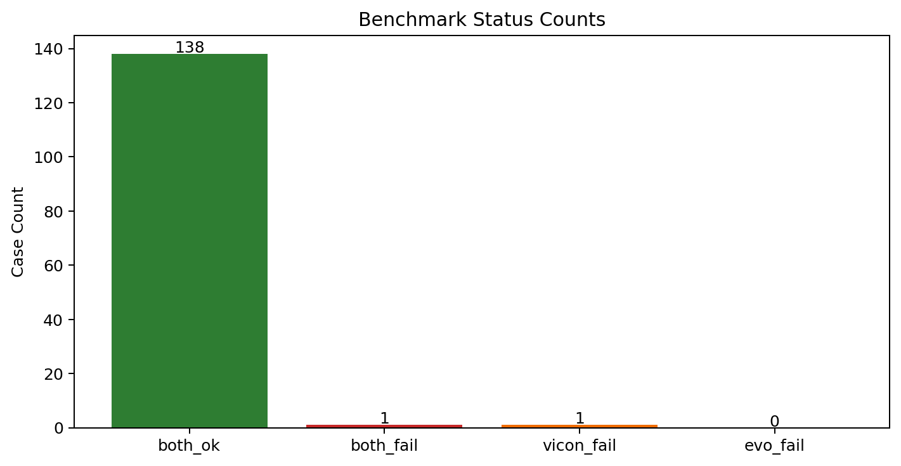
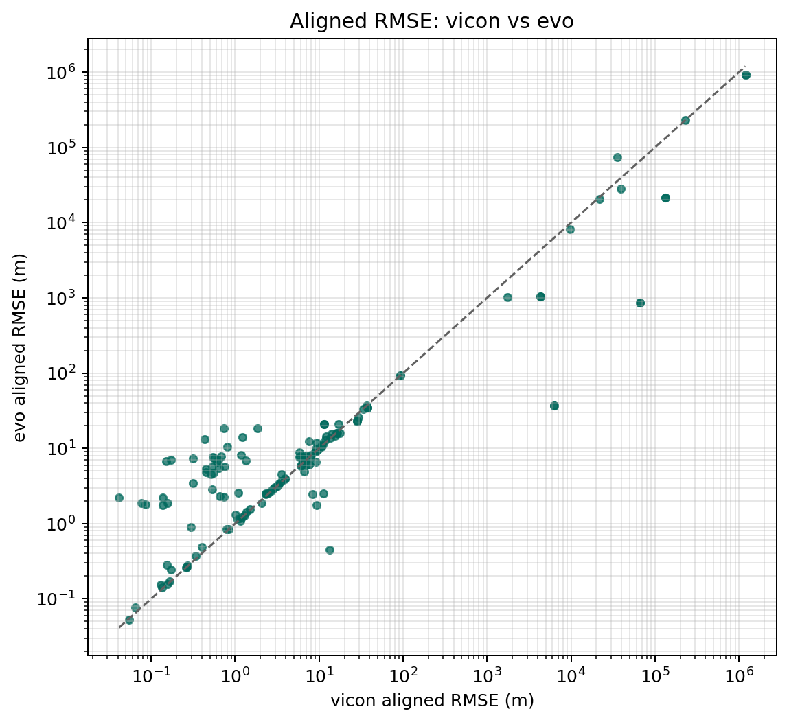
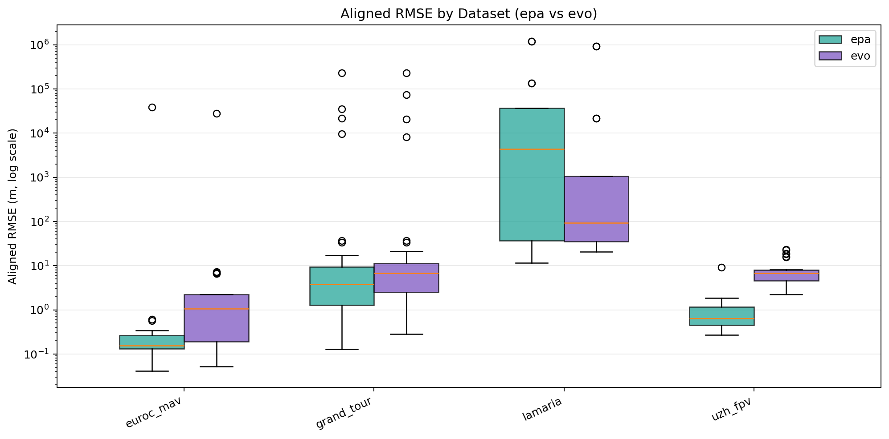

# Benchmark

This page covers the batch evaluation tools built around `epa`, including case discovery, repeated execution, and summary analysis.

## Benchmark Scope

`epa` includes a benchmark harness for large-scale case evaluation. The main goal is to run the same evaluation workflow over many prepared cases and collect consistent summaries.

In the current repository, the primary benchmark workflow is the AlignAnything harness. That harness includes an independent `epa` vs `evo` comparison, but the page is mainly about large-scale evaluation workflow and summary outputs.

## AlignAnything Harness

`epa_benchmark` runs an independent benchmark over cases discovered from an AlignAnything-style directory layout.

It:

- discover benchmark cases from prepared dataset and ground-truth directories
- run `epa` on each case
- run the comparison pipeline on the same case
- write per-case JSON records, logs, and summary tables

## Fairness and Comparison Logic

The harness evaluates `epa` and the comparison pipeline independently.

Important properties:

- offsets are not shared between systems
- `epa` uses its own internal step-1 time alignment estimate
- the comparison pipeline uses its own offset search logic inside the harness
- summary tables record both systems' offsets, match counts, and final errors

This avoids giving one system the timing result produced by the other.

## Required Inputs

Before running the harness, make sure you have:

- the AlignAnything data root with `benchmark/` and `GT/`
- the `epa` repository root
- a Python 3.10+ executable that can run `epa`
- the comparison repository path if you want cross-tool benchmarking

The harness exposes these main path options:

- `--alignanything-root`
- `--repo-root`
- `--python-bin`
- `--epa-src`
- `--evo-repo`

## Basic Run

Typical command:

```bash
epa_benchmark \
  --alignanything-root /home/yifu/epa/AlignAnything/AlignAnything \
  --repo-root /home/yifu/epa \
  --python-bin /home/yifu/miniconda3/envs/epa/bin/python \
  --evo-repo /home/yifu/evo
```

This command:

1. discover benchmark cases
2. prepare temporary TUM trajectories for each case
3. run `epa` and the comparison pipeline independently
4. aggregate the per-case outputs into a summary table

## Useful Filters

Use these options for smaller or more targeted runs:

- `--case-pattern`: regex filter for case IDs
- `--methods`: comma-separated method filter such as `rovio,svo_stereo`
- `--limit`: cap the number of cases
- `--dry-run`: discover cases without executing them

Examples:

List matching cases only:

```bash
epa_benchmark \
  --alignanything-root /home/yifu/epa/AlignAnything/AlignAnything \
  --repo-root /home/yifu/epa \
  --python-bin /home/yifu/miniconda3/envs/epa/bin/python \
  --evo-repo /home/yifu/evo \
  --case-pattern euroc \
  --dry-run
```

Run only a subset of methods:

```bash
epa_benchmark \
  --alignanything-root /home/yifu/epa/AlignAnything/AlignAnything \
  --repo-root /home/yifu/epa \
  --python-bin /home/yifu/miniconda3/envs/epa/bin/python \
  --evo-repo /home/yifu/evo \
  --methods rovio,svo_stereo \
  --limit 20
```

## Time Alignment Sweep Controls

The harness exposes offset-search controls for the comparison side of the benchmark:

- `--t-max-diff`
- `--offset-min`
- `--offset-max`
- `--offset-coarse-step`
- `--offset-refine-window`
- `--offset-refine-step`
- `--min-match-ratio`

These options control the comparison-side offset sweep.

In practice:

- widen the offset range if you expect larger timestamp drift
- reduce step size if you want finer offset search
- increase `min-match-ratio` if you want to reject weak associations

## Output Structure

Each harness run creates a fresh run directory under the benchmark output root.

Typical layout:

```text
outputs/alignanything_harness/run_YYYYmmdd_HHMMSS/
```

Common contents:

- `summary.csv`: machine-readable per-case summary
- `summary.md`: human-readable summary table
- `cases/*.json`: one JSON file per case
- `logs/`: stdout and stderr logs for executed tools
- `prepared_tum/`: prepared TUM files used by the harness
- `harness_config.json`: the run configuration snapshot
- `unresolved_cases.csv`: discovered but unresolved cases, when applicable



*Example benchmark summary: case status counts.*

## Key Columns in `summary.csv`

Important fields include:

- `case`, `dataset`, `method`
- `status`, `epa_status`, `evo_status`
- `epa_offset_est_s`, `evo_offset_s`
- `epa_ate_rmse_raw_m`, `epa_ate_rmse_step3_m`
- `evo_ape_raw_rmse_m`, `evo_ape_se3_rmse_m`
- `epa_improve_pct`, `evo_improve_pct`
- `epa_matches_equivalent`, `evo_matches`
- `epa_run_dir`
- `error`

These fields cover both metric comparison and failure diagnosis.

## Summary Plot Generation

Use `epa_plot_summary` to generate charts from a harness `summary.csv`.

Example:

```bash
epa_plot_summary \
  --summary-csv outputs/alignanything_harness/run_xxx/summary.csv
```

By default, plots are written to:

```text
<summary_dir>/plots/
```

Typical figures:

- status count chart
- aligned RMSE scatter plot
- improvement percentage scatter plot
- match-count scatter plot
- offset distribution histogram
- dataset-level aligned RMSE box plot
- top-case aligned RMSE chart



*Example benchmark comparison: aligned RMSE for `epa` vs the comparison pipeline.*



*Example benchmark comparison grouped by dataset.*

The tool also generates `plots.md` as a small index page.

Useful option:

- `--top-k`: number of cases included in the top-case bar chart

## `metrics.json` Aggregation

Use `epa_metric_res` to aggregate or compare one or more `metrics.json` files directly, without using the full harness summary workflow.

Typical example:

```bash
epa_metric_res \
  --metrics-json /path/to/metrics_a.json /path/to/metrics_b.json \
  --mode aggregate \
  --metric all \
  --stage step3
```

Main modes:

- `single`: stage comparison within one run
- `aggregate`: cross-run comparison
- `auto`: infer mode from the number of inputs

Useful options:

- `--metric`
- `--ape-relation`
- `--rpe-relation`
- `--stage`
- `--x-dimension`
- `--out-dir`

## Recommended Workflow

Recommended workflow:

1. Run `epa_benchmark`
2. Inspect `summary.csv` and `summary.md`
3. Generate charts with `epa_plot_summary`
4. Drill into failed cases using `cases/*.json` and `logs/`
5. Use `epa_metric_res` when you want additional aggregation across selected runs

## Troubleshooting Hints

If a harness run is incomplete or noisy, check these first:

- the Python executable passed with `--python-bin`
- the `AlignAnything` root path
- the comparison repository path
- unresolved cases listed in `unresolved_cases.csv`
- per-case stderr logs under `logs/`

If many cases have poor match counts, revisit:

- `t-max-diff`
- offset sweep range
- minimum match ratio
