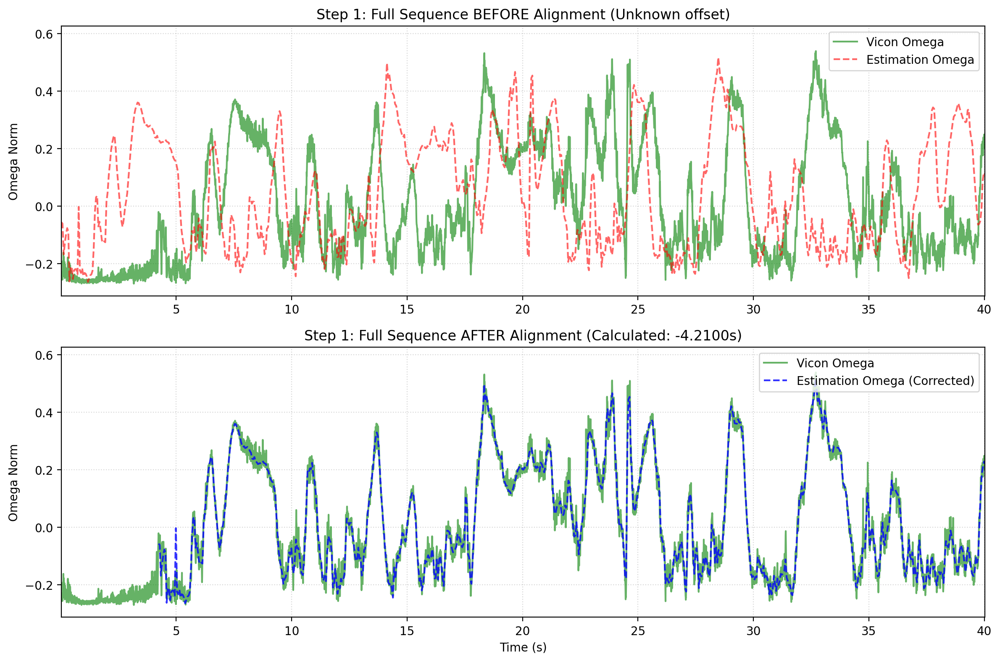
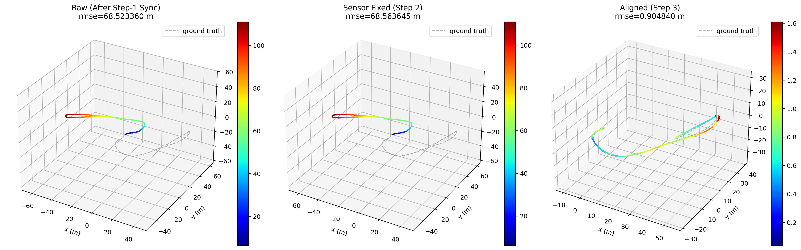

# Quick Start

## Requirements

- Python 3.10 or newer

## Installation

Create and activate a virtual environment first:

```bash
conda create -n epa python=3.10 -y
conda activate epa
```

Install the base package:

```bash
python -m pip install epica
```

Optional extras:

```bash
python -m pip install "epica[rerun]"
python -m pip install "epica[ros]"
python -m pip install "epica[geo]"
```

Use:

- `"epica[rerun]"` if you want Rerun visualization
- `"epica[ros]"` if you want to read `bag`, `bag2`, or `mcap`
- `"epica[geo]"` if you want map overlays

## Quick Start

For a general workspace:

```bash
epa --gt-csv <gt_file> --gt-format <gt_format> --est-path <est_file> --est-format <est_format> --plot
```

`--gt-format` and `--est-format` are optional. `epa` / `epica` defaults to `auto`; only set them when auto-detection is incorrect.

Example with the included files:

```bash
epa \
  --engine modular \
  --gt-csv example_data/example_groundtruth.csv \
  --est-path example_data/example_estimation.txt \
  --est-format tum \
  --t-max-diff 0.02 \
  --plot
```

This command:

1. Loads the reference trajectory from `example_data/example_groundtruth.csv`
2. Loads the estimated trajectory from `example_data/example_estimation.txt`
3. Runs time alignment, extrinsic calibration, and world-frame alignment
4. Computes evaluation metrics
5. Exports figures and summaries

Single-case full workflow:

```bash
epa_all --gt <gt_file> --est <est_file> --format tum
```

Multi-case benchmark:

```bash
epa_bench --cases-root /path/to/cases_root
```

Multi-case full workflow:

```bash
epa_benchall --cases-root /path/to/cases_root
```

For your own dataset, replace the example paths and formats:

```bash
epa \
  --gt-csv /path/to/your/gt.tum \
  --est-path /path/to/your/est.tum \
  --t-max-diff 0.02 \
  --plot \
  --rerun
```

## What You Should See

Each run creates a new directory under `outputs/`:

```text
outputs/run_YYYYmmdd_HHMMSS/
```

Typical layout:

```text
outputs/run_YYYYmmdd_HHMMSS/
├── metrics.json
├── metrics_summary.csv
├── report_en.md
├── report_zh.md
└── plots/
    ├── step1_cross_correlation.png
    ├── step1_time_alignment.png
    ├── step23_trajectory_alignment_3d.png
    ├── ape_translation_part_raw.png
    ├── ape_translation_part_hist.png
    ├── ape_translation_part_box.png
    ├── ape_translation_part_violin.png
    ├── ape_translation_part_stats.png
    ├── ape_translation_part_se3_raw.png
    ├── rpe_translation_part_raw.png
    ├── rpe_translation_part_hist.png
    ├── rpe_translation_part_box.png
    ├── rpe_translation_part_violin.png
    ├── rpe_translation_part_stats.png
    └── piecewise_segment_rmse.png
```

Most users will check these first:

- `metrics.json`
- `metrics_summary.csv`
- `report_en.md`
- `plots/step1_time_alignment.png`
- `plots/step23_trajectory_alignment_3d.png`

`report_zh.md` is also generated in the current workflow. If `--plot` is enabled, `epa` also writes metric plots into `outputs/run_.../plots/`.



*Step 1 output: rotational signals after temporal alignment.*



*Step 2 and Step 3 output: aligned trajectories in 3D.*

## Run APE and RPE

You can evaluate the same trajectories directly with the metric tools:

```bash
epa_ape tum gt.tum est.tum \
  --pose_relation trans_part \
  --align \
  --t_max_diff 0.02 \
  --plot
```

```bash
epa_rpe tum gt.tum est.tum \
  --pose_relation trans_part \
  --delta 1 \
  --delta_unit f \
  --all_pairs \
  --align \
  --plot
```

Use these commands when you want metric analysis without running the full pipeline.

## Inspect Trajectories

Use `epa_traj` to inspect, synchronize, and plot trajectories:

```bash
epa_traj --format tum --plot --plot-mode xz gt.tum est.tum
```

Common variants:

- Synchronize before plotting: `epa_traj --format tum --sync --ref 1 gt.tum est.tum --plot`
- Align to the reference: `epa_traj --format tum --sync --align --ref 1 gt.tum est.tum --plot`
- Export converted trajectories: `epa_traj --format auto --save-as tum --out-dir outputs/traj_exports example_data/example_groundtruth.csv example_data/example_estimation.txt`

## ROS Bag Inputs

If your trajectories are stored in ROS logs, install ROS support first:

```bash
python -m pip install "epica[ros]"
```

Then provide both the format and topic:

```bash
epa \
  --engine modular \
  --gt-csv /path/to/run.bag \
  --gt-format bag \
  --gt-topic /vicon/pose \
  --est-path /path/to/run.bag \
  --est-format bag \
  --est-topic /odom
```

Supported ROS log inputs:

- `bag`
- `bag2`
- `mcap`

## Optional Rerun Visualization

If [Rerun](https://github.com/rerun-io/rerun) support is installed, add `--rerun` to the main pipeline or metric tools:

```bash
epa \
  --engine modular \
  --gt-csv example_data/example_groundtruth.csv \
  --est-path example_data/example_estimation.txt \
  --est-format tum \
  --plot \
  --rerun
```

<video class="doc-video" controls muted loop playsinline preload="metadata">
  <source src="../images/rerun.mp4" type="video/mp4">
</video>

*Rerun demo: interactive follow-view playback during trajectory inspection.*

Use this to inspect trajectory geometry and intermediate alignment stages.

## Useful Help Commands

```bash
epa --help
epa_traj --help
epa_ape --help
epa_rpe --help
epa_res --help
epa_config --help
```

## Next Steps

- Go to [CLI Reference](cli.md) for command-level options
- Go to [Benchmark Workflow](benchmark_workflow.md) for batch evaluation workflows
- Go to [Troubleshooting](troubleshooting.md) if your first run fails
