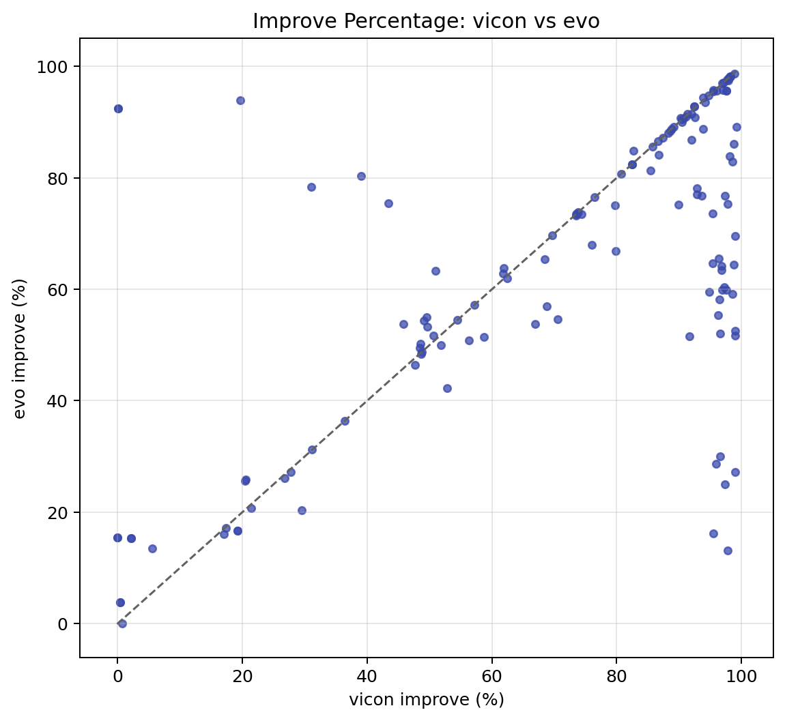
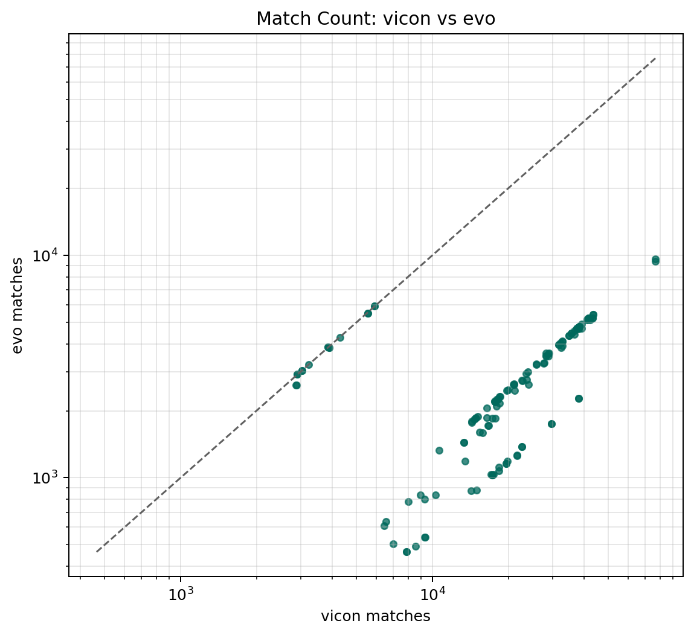
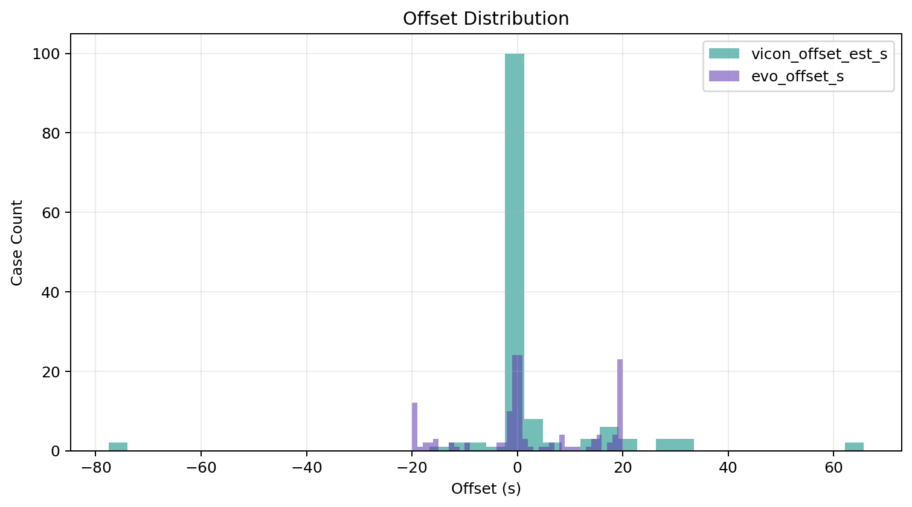
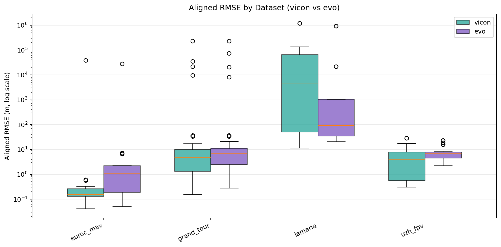
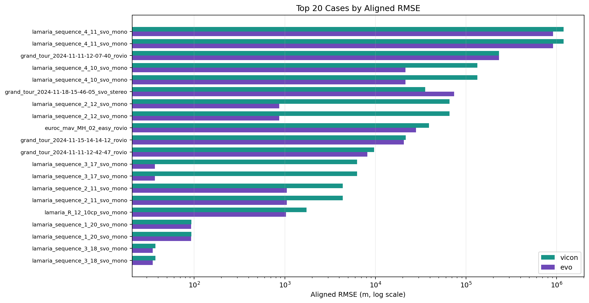

# Summary Plots

source: `/home/yifu/vicon_ws/summary.csv`

## status counts

## aligned rmse scatter log

## improve pct scatter

## matches scatter log

## offset distribution

## aligned rmse by dataset box

## top cases aligned rmse

